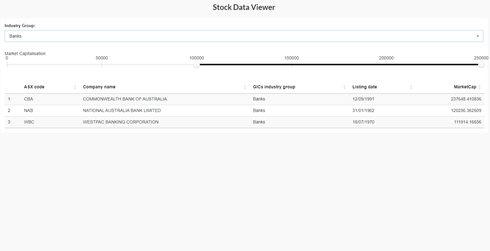

<!-- README.md is generated from README.Rmd. Please edit that file -->

```{r, include = FALSE}
knitr::opts_chunk$set(
  collapse = TRUE,
  comment = "#>",
  fig.path = "man/figures/README-",
  out.width = "100%"
)
```

# ozstockpickr

<!-- badges: start -->

<!-- badges: end -->

'ozstockpicker' is an R package designed to assist users in analyzing and visualizing stock market data, specifically focusing on Australian stocks. The package includes a Shiny application that allows for interactive exploration of stock data through the stockdash() function.

## Installation

You can install the development version of ozstockpickr from [GitHub](https://github.com/ETC5523-2024/assignment-4-packages-and-shiny-apps-AneeshAgarwala) with:

```{r install, eval = FALSE}
# Install devtools if you haven't already
install.packages("devtools")

# Install ozstockpicker from GitHub
devtools::install_github("ETC5523-2024/assignment-4-packages-and-shiny-apps-AneeshAgarwala")
```

## Launching Stock Dashboard

```{r example, eval=FALSE}
library(ozstockpickr)
stockdash()
```

{width="685"}

## Dependencies

The 'ozstockpicker' package relies on the following R packages:

-   shiny

-   DT

-   shiny.semantic

Make sure these packages are installed, as they are required to run the Shiny application.

## Data

The application uses a data set containing Australian stock market data.

## License

This package is licensed under the MIT License. See the LICENSE file for details.
